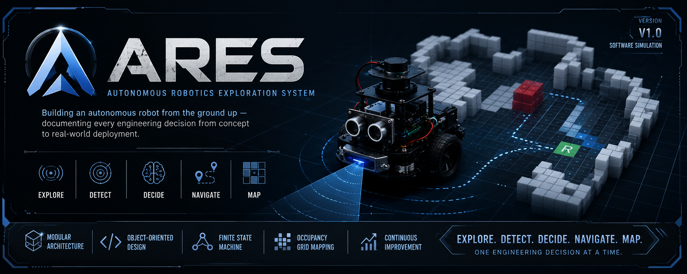

<p align="center">
  
</p>

> 🚧 **This project is under active development.**
>
> ARES is being developed incrementally. Every major design decision, implementation step, and engineering challenge is documented in the Development Diary.
# ARES
### Autonomous Robotics Exploration System

> A modular autonomous mobile robot developed from scratch to explore unknown indoor environments using finite state machines, object-oriented software architecture, and occupancy grid mapping.

---

## Overview

ARES is a long-term robotics project that combines software engineering, embedded systems, and autonomous navigation.

The primary objective is to design a robot capable of exploring an unknown indoor environment, avoiding obstacles, building an occupancy grid map, and making navigation decisions autonomously.

The project is being developed incrementally through multiple versions, allowing every stage of the design process to be documented and improved.

---

## Current Status

**Current Version:** V1 — Software Simulation

Current progress includes:

- Finite State Machine (FSM)
- Object-Oriented Software Architecture
- Terminal-based Robot Simulation
- Occupancy Grid Mapping
- Navigation Logic
- Development Diary
- Hardware Research

---

## Project Roadmap

| Version | Status | Description |
|----------|--------|-------------|
| V1 | ✅ Completed | Software simulation and architecture |
| V2 | 🟡 In Progress | Arduino integration |
| V3 | ⬜ Planned | Autonomous exploration with real sensors |
| V4 | ⬜ Planned | STM32 migration and advanced navigation |

---

## Software Architecture

ARES is built using a modular object-oriented architecture.

Core classes include:

- Robot
- StateMachine
- DistanceSensor
- MotorController
- OccupancyGridMap

Each class has a single responsibility, making the project scalable and suitable for future hardware integration.

---

# Simulation

The current version of ARES includes a complete terminal-based simulation of the autonomous exploration process.

The simulation demonstrates the robot's decision-making cycle, finite state machine execution, occupancy grid updates, and autonomous navigation behavior before deploying the software to real hardware.

<p align="center">
  
</p>

The simulation follows the same software architecture that will later be deployed on the Arduino-based robot, making it an important validation step before hardware integration.

---

## Features

- Modular OOP architecture
- Finite State Machine (FSM)
- Autonomous navigation logic
- Occupancy Grid Mapping
- Dynamic map expansion
- Hardware-independent software design
- Arduino-ready architecture
- Future STM32 compatibility

---

## Technologies

- C++
- Object-Oriented Programming
- Finite State Machines
- Occupancy Grid Mapping
- Arduino
- Embedded Systems
- Robotics

---

## Repository Structure

```text
ARES/
│
├── docs/
│   ├── architecture/
│   ├── development-diary/
│   ├── diagrams/
│   └── reports/
│
├── images/
├── media/
├── src/
│
├── README.md
├── LICENSE
└── .gitignore
```

---

## Development Diary

The complete development process is documented from the very first sketch to hardware implementation.

Topics include:

- Planning
- Software Architecture
- FSM Design
- Occupancy Grid Mapping
- Hardware Research
- Design Decisions
- Engineering Challenges

---

## Future Development

Upcoming milestones include:

- Arduino implementation
- Real ultrasonic sensor integration
- Real motor control
- Indoor autonomous exploration
- Mapping optimization
- STM32 migration
- Sensor fusion
- Path planning

---

## License

This project is licensed under the MIT License.

---

## Author

Developed by **İclal Sevde Yavuz**

Computer Engineering Student

Kadir Has University
=======
# ARES

> **Autonomous Rescue & Exploration System**

### Building autonomous robots from software architecture to real-world exploration.

⚠️ **Status:** Active Development (V1 Completed)

ARES is a long-term robotics platform focused on building an autonomous robot capable of exploring unknown indoor environments without relying on GPS.

Unlike projects that start directly with hardware, ARES begins with a software-first approach. The goal is to build a modular architecture where navigation, sensing, mapping, and motor control evolve independently before being integrated into a physical robot.

Current version: **V1 Terminal Simulation**

---

## Current Capabilities

✔ Finite State Machine (FSM) navigation

✔ Dynamic Occupancy Grid Mapping

✔ Modular Object-Oriented C++ Architecture

✔ Autonomous Sense → Decide → Act cycle

✔ Hardware-independent software layer

---

**Next milestone:** Arduino-based autonomous rover (V2)
>>>>>>> 8dc5228f724f34f28648ca1ed0d878428f926f6d
