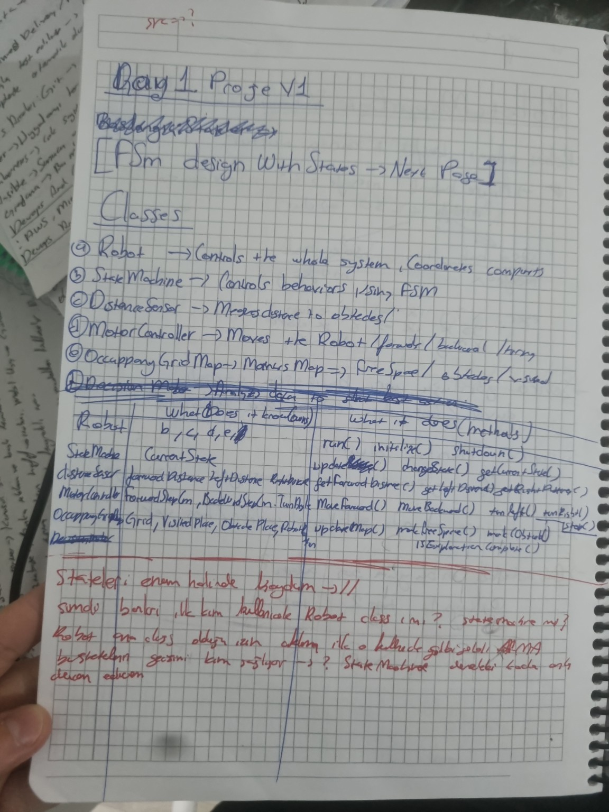
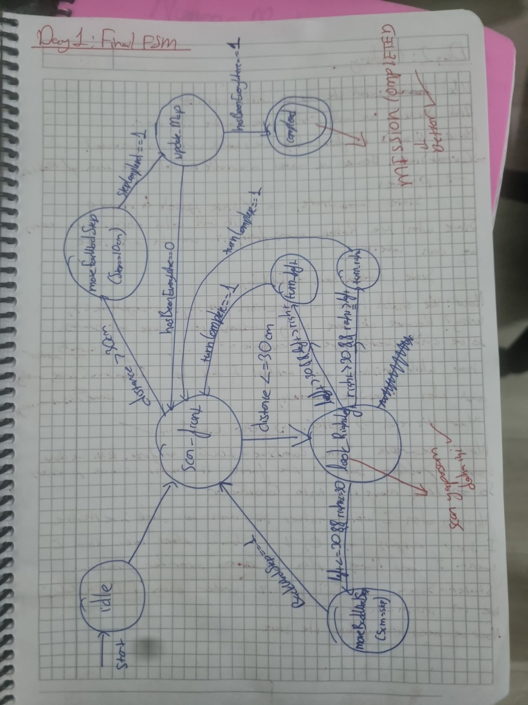

# Day 01 — Project Planning & FSM Design

## Goal

Define the first software architecture of ARES before writing any code.

## What I Worked On

- Designed the first Finite State Machine (FSM).
- Defined the initial robot behaviors.
- Planned the object-oriented software architecture.
- Identified the core classes required for the project.
- Refined the FSM after reviewing the transition logic.

## Planned Classes

- `Robot`
- `StateMachine`
- `DistanceSensor`
- `MotorController`
- `OccupancyGridMap`

## Key Decisions

- Separate navigation logic from hardware implementation.
- Use a Finite State Machine to control robot behavior.
- Build the project with an object-oriented and modular architecture.
- Keep the software suitable for future Arduino and STM32 integration.

## Challenges and Design Questions

During the planning stage, I considered how the classes should interact with each other.

Some of the main questions were:

- Should the `Robot` class control the entire system?
- Should the `StateMachine` be a separate class?
- Which class should manage state transitions?
- How should sensor, motor and mapping responsibilities be separated?

Reviewing these questions helped me define clearer responsibilities for each component.

While designing the FSM, I also noticed that several transitions needed to be reconsidered. I reviewed the logic and refined the state diagram before beginning the implementation.

## Initial Architecture Notes

## Final FSM Sketch

## Result

The first software architecture and FSM design were completed.

This planning stage created the foundation for the ARES V1 terminal simulation.