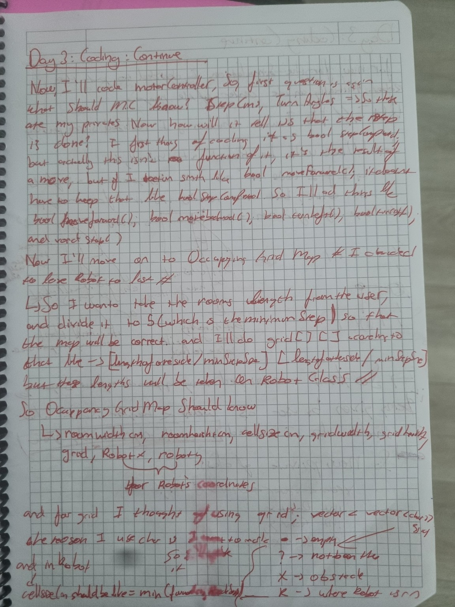
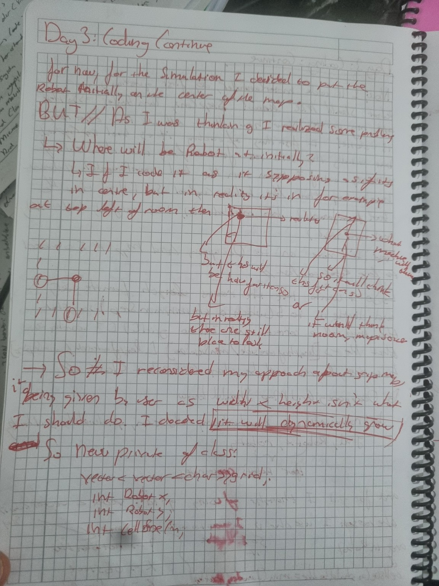
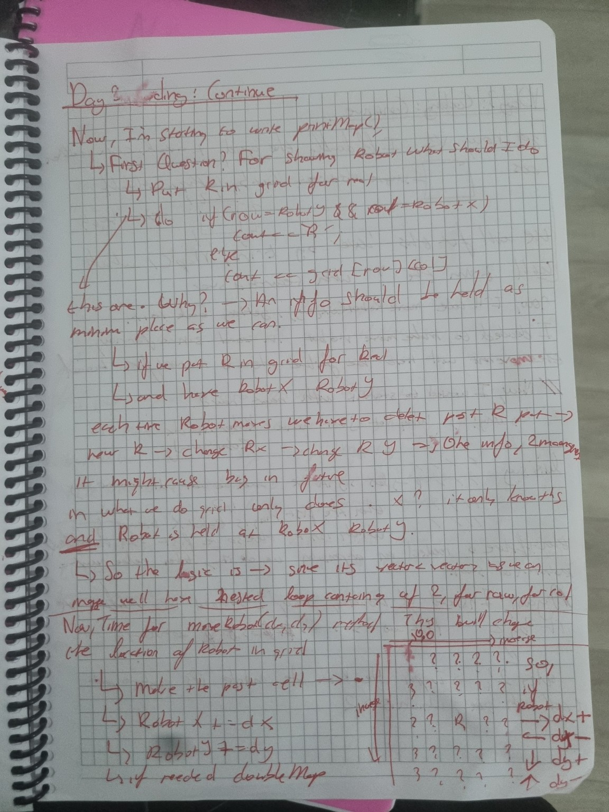
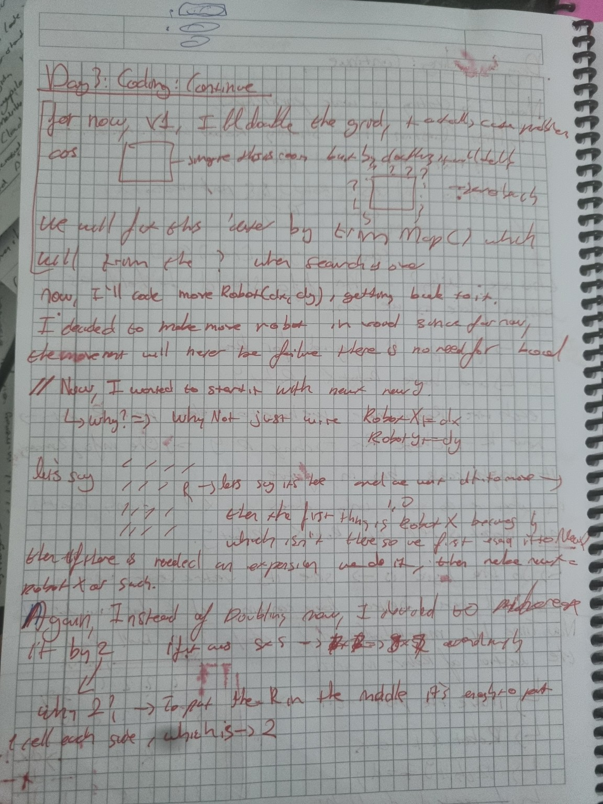

# Day 03 — Designing Navigation and Occupancy Grid Mapping

## Goal

Continue implementing the core software architecture by designing the robot movement system and the occupancy grid map.

---

## What I Worked On

- Designed the `MotorController` class.
- Defined the movement interface for forward, backward and turning actions.
- Planned how movement completion would be reported back to the FSM.
- Started implementing the `OccupancyGridMap` class.
- Designed how the robot position would be represented inside the map.
- Developed the first `printMap()` logic.
- Designed the `moveRobot(dx, dy)` algorithm.
- Planned the first map expansion strategy.

---

## Design Decisions

### MotorController Responsibilities

Before writing the class, I asked myself what information the motor controller should actually own.

I decided that it should store:

- Forward step distance
- Backward step distance
- Turning angle

Instead of exposing internal variables, every movement would be represented through dedicated functions such as:

- `moveForward()`
- `moveBackward()`
- `turnLeft()`
- `turnRight()`
- `stop()`

This keeps the movement interface independent from the finite state machine.

---

### Designing the Occupancy Grid

Initially, I considered asking the user to provide the room dimensions before the simulation started.

The idea was to create a fixed-size occupancy grid based on those values.

However, while thinking about real-world exploration, I realized that a robot should not assume it already knows the room boundaries.

This led me to redesign the mapping system.

---

### Dynamic Map Expansion

Instead of allocating the entire map at the beginning, I decided that the map should grow dynamically as the robot explores new areas.

This approach is much closer to how an autonomous exploration robot behaves in an unknown environment.

---

### Representing the Robot

At first, I considered storing the robot directly inside the grid as the character `R`.

After further analysis, I realized that this would require constantly deleting and rewriting the robot position every time it moved.

Instead, I decided to store the robot coordinates separately using:

- `robotX`
- `robotY`

During map printing, the robot would simply be rendered at those coordinates.

This keeps the map data clean and avoids unnecessary updates.

---

## Engineering Questions Considered

While implementing the mapping system, I continuously questioned the architecture.

Some of the questions included:

- Should the map have a fixed size?
- Should the robot be stored inside the grid?
- How should unknown cells be represented?
- How should obstacles be marked?
- How can the map expand without losing previous information?
- How can the design remain compatible with future hardware integration?

Answering these questions significantly improved the software architecture.

---

## Challenges

The biggest challenge was deciding how the map should grow.

At first, I considered doubling the map size whenever expansion was needed.

After further thinking, I realized that this would introduce a large amount of unnecessary unexplored space.

Instead, I redesigned the expansion strategy to grow the map in a more controlled manner while preserving the existing data.

---

## Development Notes

### MotorController Design

### Occupancy Grid Planning

### Robot Position and Map Logic

### Dynamic Map Expansion

---

## Result

By the end of Day 03, the navigation layer and occupancy grid architecture were largely designed.

The project now had a clear plan for robot movement, position tracking, and dynamic map expansion, providing a solid foundation for future autonomous exploration.