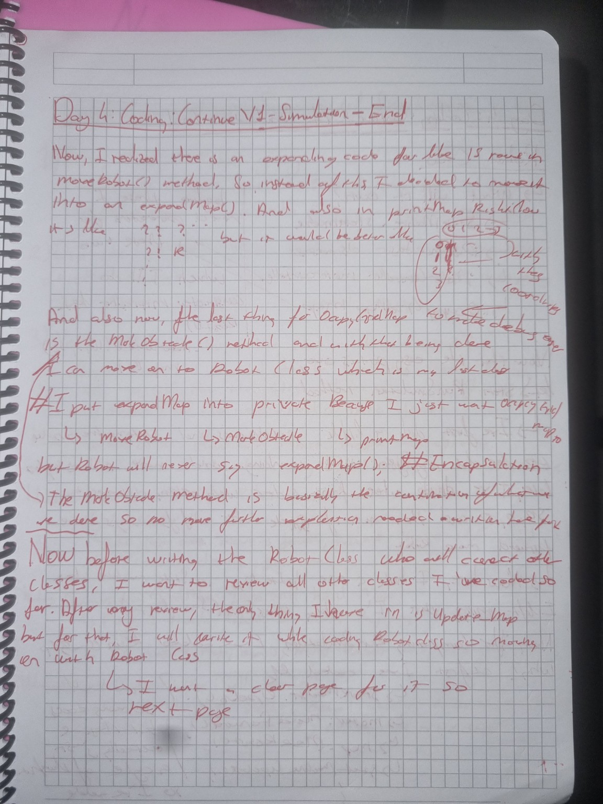
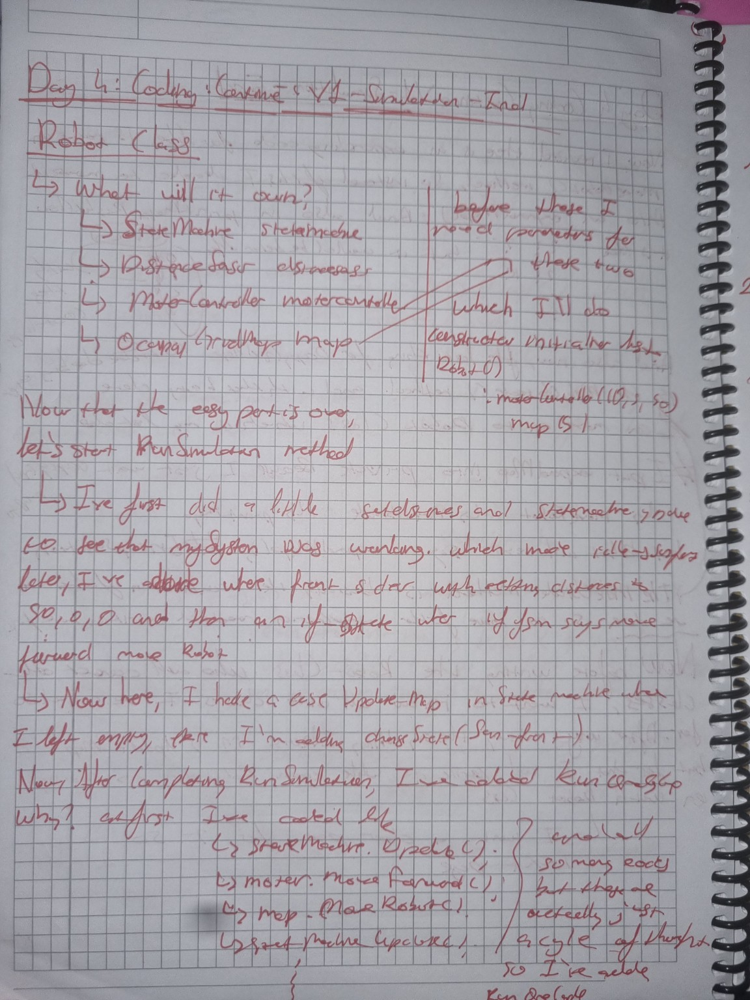
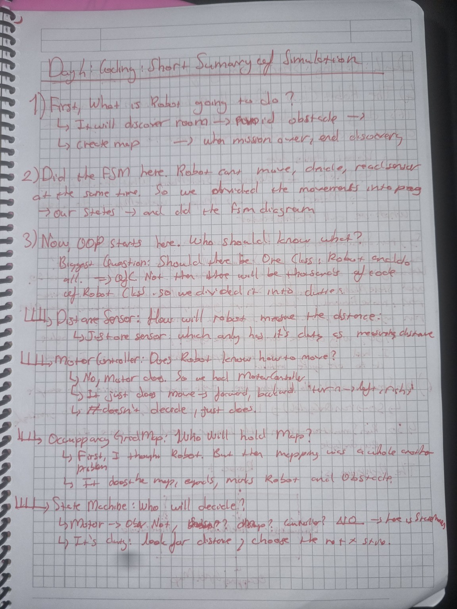
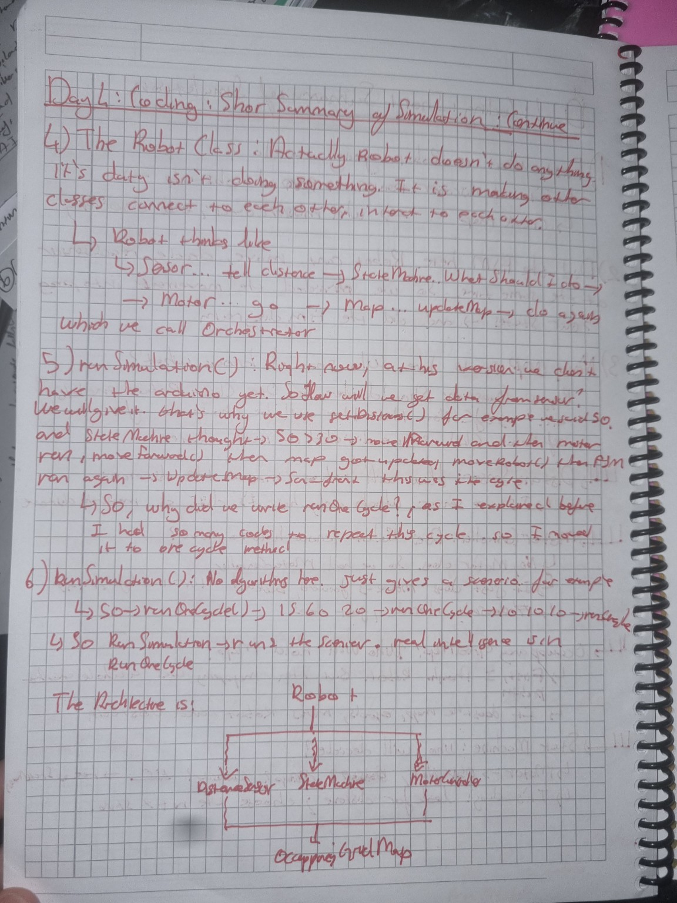

# Day 04 — Completing the V1 Simulation Architecture

## Goal

Complete the first version of the ARES simulation by integrating all software components into a single modular architecture and establishing the complete execution flow.

---

## What I Worked On

- Refactored the map expansion logic into a dedicated `expandMap()` method.
- Improved the implementation of `printMap()`.
- Completed the `markObstacle()` functionality.
- Started implementing the `Robot` class.
- Defined the ownership relationship between all software components.
- Designed and implemented the first version of `runSimulation()`.
- Created a reusable simulation cycle.
- Reviewed the entire architecture before continuing development.

---

## Design Decisions

### Refactoring Map Expansion

While implementing `moveRobot()`, I realized that handling map expansion inside the movement function made the code unnecessarily large and difficult to maintain.

Instead, I extracted the expansion logic into a dedicated private method.

```cpp
void expandMap();
```

Now each function has a single responsibility, making the code cleaner and easier to maintain.

---

### Encapsulation

The `expandMap()` method is intentionally private.

The Robot should never decide when the map expands.

Instead, higher-level public methods such as

- `moveRobot()`
- `markObstacle()`
- `printMap()`

internally determine whether expansion is necessary.

This follows the principle of encapsulation by hiding implementation details from the rest of the project.

---

### Designing the Robot Class

Before writing the Robot class, I first asked:

> **What should the Robot actually own?**

After reviewing the architecture, I decided that the Robot should contain the project's major software components:

- `StateMachine`
- `DistanceSensor`
- `MotorController`
- `OccupancyGridMap`

Rather than implementing movement, sensing, or mapping itself, the Robot became responsible for coordinating communication between these classes.

---

## Engineering Questions Considered

Throughout development I continuously challenged my own design decisions.

Some of the questions I considered were:

- Should the Robot contain all project logic?
- Should software components communicate directly with each other?
- Which class should control the simulation loop?
- How should repeated execution logic be organized?
- How can the architecture remain modular for future hardware integration?

Answering these questions significantly improved the overall software architecture.

---

## Discovering the Robot's Real Responsibility

One of the biggest realizations during Day 04 was understanding that the Robot itself should not perform every task.

Instead, every class should have a single responsibility.

- **DistanceSensor** measures distances.
- **StateMachine** decides the robot's next action.
- **MotorController** executes movement.
- **OccupancyGridMap** stores and updates the environment.

The Robot simply coordinates these components.

This effectively turns the Robot into the system's orchestrator, responsible for connecting independent modules without taking over their individual responsibilities.

---

## Building the Simulation Loop

While writing the simulation, I noticed that the following sequence was repeated continuously:

1. Read sensor data.
2. Update the finite state machine.
3. Execute the selected movement.
4. Update the occupancy grid.
5. Repeat until exploration is complete.

Rather than duplicating this sequence throughout the project, I encapsulated it inside a reusable execution cycle that became the foundation of `runSimulation()`.

This approach makes the simulation significantly cleaner and much easier to extend in future versions.

---

## Reviewing the Architecture

Before adding additional features, I intentionally stopped writing new code and reviewed every class that had been implemented so far.

This review helped verify that:

- every class had a single responsibility,
- communication between components remained clean,
- implementation details stayed hidden,
- and the overall architecture would remain scalable as the project grew.

Performing this review before continuing development reduced future complexity and prevented unnecessary coupling between classes.

---

## Challenges

The largest challenge was no longer writing individual functions.

Instead, it became organizing the interaction between multiple classes while keeping the architecture modular.

Several methods were simplified, responsibilities were redistributed, and the overall execution flow was redesigned before moving forward.

Although this required extra work, it resulted in a much cleaner software architecture.

---

## Development Notes

### Refactoring the Map Expansion Logic



### Designing the Robot Class



### Reviewing the Software Architecture



### Final Simulation Workflow



---

## Result

By the end of Day 04, the first version of the ARES simulation architecture was fully established.

The major software components were successfully integrated through the Robot class, the simulation execution cycle was completed, and the project now had a clean, modular architecture that is ready for future hardware integration with Arduino and STM32.