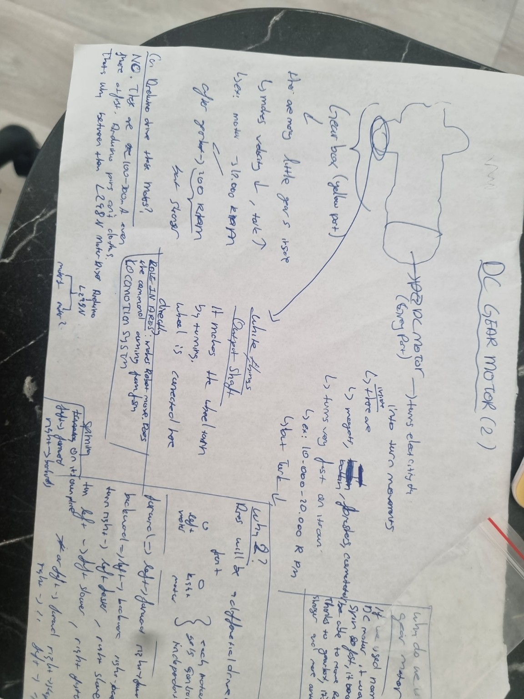
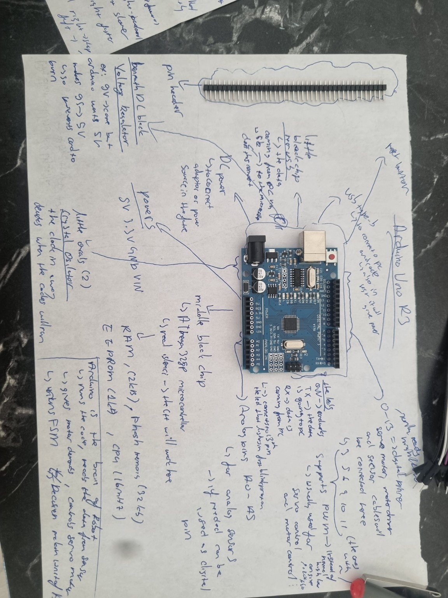
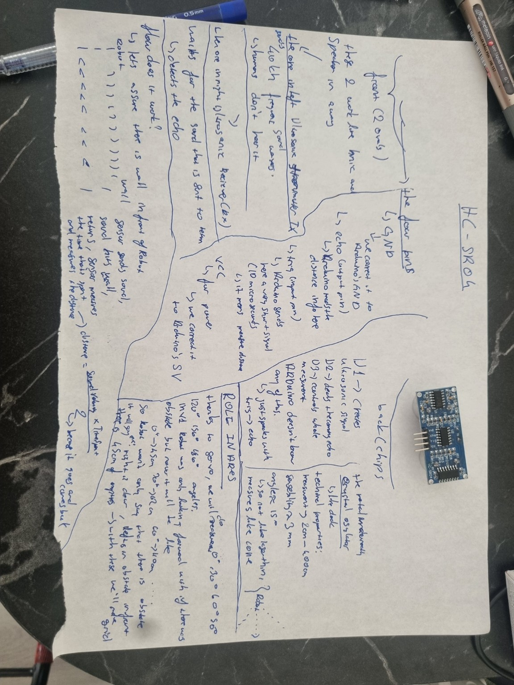
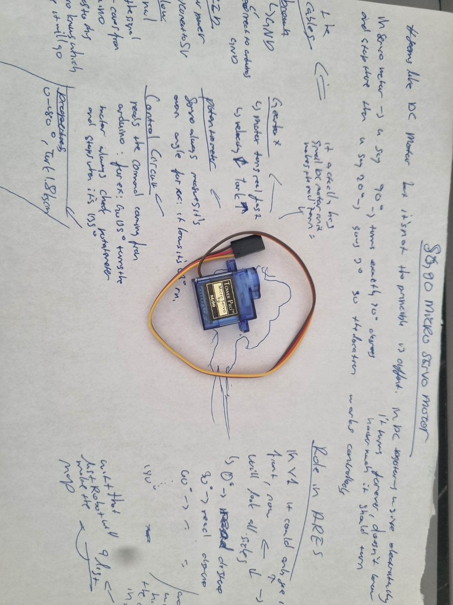
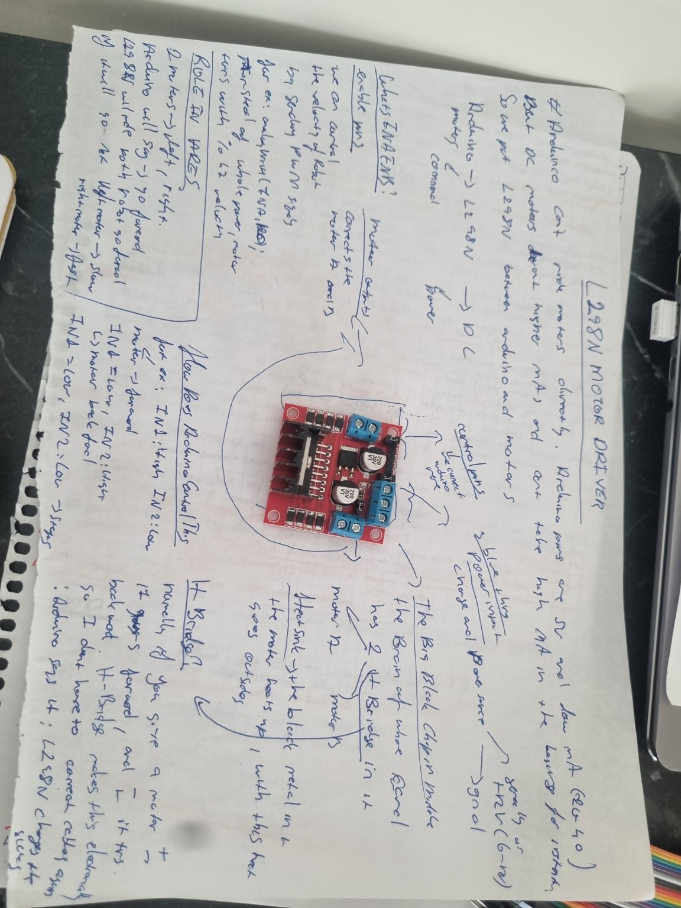

# Day 05 — Understanding the Hardware Platform

## Goal

Build a solid understanding of the hardware components that will power the ARES robot before beginning the physical implementation.

Rather than connecting components immediately, I wanted to understand **what every module does, why it exists, and how it fits into the overall architecture.**

---

## What I Studied

During this session, I researched and documented the hardware components that will be used throughout the ARES project.

The components included:

- Arduino Uno R3
- HC-SR04 Ultrasonic Distance Sensor
- SG90 Micro Servo Motor
- DC Gear Motor
- L298N Motor Driver

For each component, I focused on both its internal working principle and its role inside ARES.

---

## DC Gear Motor

I studied how a standard DC motor converts electrical energy into rotational motion and how the attached gearbox reduces speed while increasing torque.

Topics covered included:

- Difference between a DC motor and a DC gear motor.
- RPM vs Torque.
- Why gear reduction is necessary.
- Why ARES requires high torque instead of high rotational speed.
- Differential drive using two independent motors.

---

## Arduino Uno R3

Before programming the robot, I wanted to understand the hardware that would execute the software.

I explored:

- ATmega328P microcontroller
- Digital and analog pins
- PWM outputs
- Power pins
- Voltage regulation
- Memory architecture (Flash, SRAM and EEPROM)
- How Arduino communicates with external sensors and actuators.

Rather than viewing Arduino as "just a board", I studied how it actually operates internally.

---

## HC-SR04 Ultrasonic Sensor

Since obstacle detection is one of the core capabilities of ARES, I researched how ultrasonic sensing works.

Topics included:

- Trigger and Echo pins.
- Time-of-flight distance measurement.
- Speed of sound calculations.
- Measuring distance using reflected ultrasonic waves.
- Sensor limitations.
- Detection range and accuracy.

I also considered how this sensor would be integrated into the finite state machine developed in previous days.

---

## SG90 Micro Servo

The ultrasonic sensor needs to observe multiple directions instead of looking only forward.

For this reason, I studied servo motors and their operation.

Topics included:

- PWM control.
- Servo positioning.
- Internal feedback mechanism.
- Potentiometer.
- Control circuitry.
- Rotation limits.
- Why a servo is ideal for rotating the ultrasonic sensor during environment scanning.

---

## L298N Motor Driver

I also studied the component responsible for controlling the two drive motors.

Topics included:

- H-Bridge principle.
- Motor direction control.
- Motor speed control using PWM.
- Input and output pins.
- Power distribution.
- Why Arduino cannot power motors directly.
- Why a motor driver is required between the Arduino and the motors.

---

## Engineering Questions Considered

During the research, I continuously asked practical engineering questions, including:

- Why can't Arduino power the motors directly?
- Why is a gearbox necessary?
- Why use two motors instead of one?
- Why is a servo used instead of another DC motor?
- Why is PWM required?
- How will these components interact with the software architecture developed in previous days?

Answering these questions helped me understand not only *how* each component works, but also *why* it belongs in the ARES system.

---

## Development Notes

### DC Gear Motor

---

### Arduino Uno R3

---

### HC-SR04 Ultrasonic Sensor

---

### SG90 Micro Servo

---

### L298N Motor Driver

---

## Result

By the end of Day 05, I had developed a much deeper understanding of the hardware platform that will support ARES.

Instead of treating each module as a black box, I now understand its operating principles, limitations, and role within the complete robotics system.

This knowledge will serve as the foundation for integrating software and hardware during the next development stage.